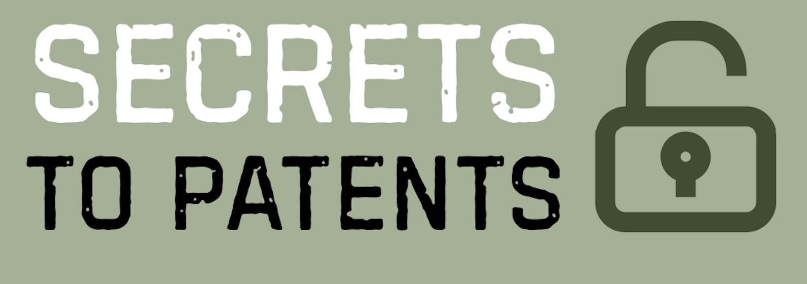

[](https://doi.org/10.5281/zenodo.19422611)
<a href="https://secretstopatents.org/"></a>
<a href="https://creativecommons.org/licenses/by-nc/4.0/"></a>

# catalogue-hagstrom

Extraction pipeline for the Hagstrom manuscript catalogue. Converts scanned PDF
volumes into individual card images, runs OCR on each card, and produces
browsable output.

## Project

This catalogue is part of the [*Secrets to Patent*](https://secretstopatents.org/)
project. The catalogue cards belong to the
[Hagströmer Library](https://kib.ki.se/en/hagstromerbiblioteket/about-hagstromerbiblioteket)
at Karolinska Institutet, which holds over 150,000 books and journals in
the medical sciences from the period 1600–1990. The original scanned
PDF volumes are available on
[ALVIN](https://alvin-portal.org/) under a CC0 license.

**Contributors:** Mathias Johansson, Cecilia Lundström, Natacha Klein Käfer

## License

This work is licensed under a
[Creative Commons Attribution-NonCommercial 4.0 International License](https://creativecommons.org/licenses/by-nc/4.0/)
(CC BY-NC 4.0). See [LICENSE](LICENSE) for the full text.

## Citation

If you use this catalogue in your research, please cite it as:

> Johansson, M., Lundström, C., & Klein Käfer, N. (2026).
> *Hagströmer Library Catalogue* [Data set].
> Digital History Lund / Secrets to Patent.
> https://doi.org/10.5281/zenodo.19422611

BibTeX:

```bibtex
@software{mathias_johansson_2026_19422611,
  author       = {Mathias Johansson and
                  Lundström, Cecilia and
                  Klein Käfer, Natacha},
  title        = {DigitalHistory-Lund/SecToPat-HagstromerCatalogue:
                   v0.1.1
                  },
  month        = apr,
  year         = 2026,
  publisher    = {Zenodo},
  version      = {v0.1.1},
  doi          = {10.5281/zenodo.19422611},
  url          = {https://doi.org/10.5281/zenodo.19422611},
}
```

## Images

TODO: find a permanent home for the images ([#6](https://github.com/DigitalHistory-Lund/SecToPat-HagstromerCatalogue/issues/6))

## Pipeline

```
PDF volumes ─► Page images ─► Card images ─► OCR text
                                                │
                                    ┌───────────┴───────────┐
                                    ▼                       ▼
                              Markdown reader         Card PDF
```

Each PDF page contains up to 8 catalogue cards arranged in a 2×4 grid.
The pipeline detects and extracts individual cards using OpenCV, then runs
OCR via a local Ollama vision-language model.

## Setup

```bash
cp .env.example .env
# Edit .env — set RAW_CAT_PATH to the directory containing the PDF volumes
pip install -r requirements.txt  # or use the venv
```

Requires [Ollama](https://ollama.com) running locally with the configured model
(default: `qwen3-vl:2b`).

## Usage

### Main pipeline

```bash
# Run full pipeline (subset controlled by .env)
python -m src

# Run all volumes
python -m src --all

# Run a single step
python -m src --step pages
python -m src --step cards
python -m src --step ocr

# Parallel processing
python -m src --workers 4

# Overwrite existing outputs
python -m src --force

# Save intermediate card-detection debug images
python -m src --debug
```

### Generate markdown reader

Produces a `reader/` directory with per-volume/per-page markdown files showing
each card image alongside its OCR text.

```bash
python -m src --step reader
```

### Generate card PDF

Creates a PDF with 4 cards per page — card image on the left, OCR text on
the right. Cards are ordered by filename (left column first, right column
second) to preserve the original page layout.

```bash
python -m src --step card-pdf
```

### Check images

Validates that extracted card images are present and not corrupted.

```bash
python -m src --step check-images
```

## Project structure

```
src/
  __main__.py          CLI orchestrator
  config.py            Configuration from .env
  extract_pages.py     PDF → page images (PyMuPDF)
  extract_cards.py     Page images → card images (OpenCV)
  ocr_cards.py         Card images → text (Ollama VLM)
  check_images.py      Card image validation
  generate_reader.py   Markdown reader generator
  generate_card_pdf.py PDF card+text report generator
  subset.py            Subset selection for development

extracted_images/      Page images (PNG)
extracted_cards/       Individual card images (PNG)
ocr_output/            Raw OCR output (regenerated by the pipeline)
transcriptions/        Curated transcriptions (versioned, the definitive text)
reader/                Generated markdown reader

.env.example           Configuration template
```

## Naming convention

Files follow the pattern `{volume}_{page}_{column}_{row}`:

- `01_0009_0_2.png` — Volume 01, page 9, column 0, row 2

Columns 0–3 are the left half of the original page, columns 1–3 the right.
Within each column, rows run top to bottom.

## Tools & dependencies

| Tool | Role |
|---|---|
| [PyMuPDF (fitz)](https://pymupdf.readthedocs.io/) | PDF → page-image rendering |
| [OpenCV](https://opencv.org/) | Card detection & image processing |
| [Ollama](https://ollama.com/) | Local VLM inference server |
| [Qwen2.5-VL](https://huggingface.co/Qwen/Qwen2.5-VL-7B-Instruct) | Vision-language model for OCR (configurable via `OCR_MODEL`) |
| [python-dotenv](https://github.com/theskumar/python-dotenv) | `.env` configuration loading |
| [tqdm](https://tqdm.github.io/) | Progress bars |
| [NumPy](https://numpy.org/) | Array operations (used by OpenCV) |
| [Claude](https://claude.ai/) | AI coding assistant used during development |

## Configuration

All parameters are set via `.env`. Card detection thresholds (the `CV_*`
variables) control the OpenCV edge detection, morphology, and contour
filtering used to locate cards on each page. See `.env.example` for defaults.
